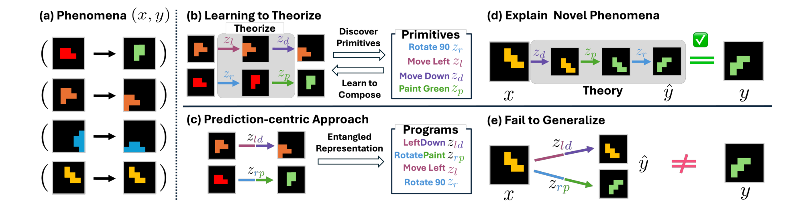

<div align="center">
  <h1>
    <em>
      Learning to Theorize the World from Observation
    </em>
  </h1>

  <p>
    <a href="https://doojinbaek.github.io/publications/learning-to-theorize-the-world/">
      
    </a>
    <a href="https://arxiv.org/abs/2605.03413">
      
    </a>
    <a href="https://icml.cc/virtual/2026/oral/71176">
      
    </a>
    <a href="https://compositional-learning.github.io/#:~:text=Doojin%20Baek%2C%20Gyubin%20Lee%2C%20Junyeob%20Baek%2C%20Hosung%20Lee%2C%20Sungjin%20Ahn.%20Learning%20to%20Theorize%20the%20World%20from%20Observation.">
      
    </a>
  </p>

  <p>
    <a href="https://doojinbaek.github.io/">Doojin Baek</a><sup>&#42;</sup>,
    <a href="https://lee-gyubin.github.io/">Gyubin Lee</a><sup>&#42;</sup>,
    <a href="https://dion-jy.github.io/">Junyeob Baek</a>,
    <a href="https://confeitohs.notion.site/">Hosung Lee</a>, and
    <a href="https://mlml.kaist.ac.kr/sungjinahn">Sungjin Ahn</a>
  </p>

  <p><sup>&#42;</sup> Equal contribution</p>

  <p>
    <strong>
      Official PyTorch code for the
      <a href="https://icml.cc/virtual/2026/poster/60765">ICML 2026 Oral</a>
      paper, recipient of the
      <a href="https://compositional-learning.github.io/">CompLearn 2026 Best Paper Award</a>.
    </strong>
  </p>
</div>

<p align="center">
  
</p>

Neural Theorizer (NEO) instantiates Learning-to-Theorize (L2T) as latent
program induction. From raw before-and-after observations, NEO learns reusable
primitive operations and composes them into executable theories that transfer
to new observations.

## Setup

Use Python 3.10 and PyTorch 2.7.1 with CUDA 12.6. The pinned installation is in
[environments/README.md](environments/README.md).

## Train and evaluate

The same scripts support `gridworld`, `arithmetic_factorization`, and
`image_editing`. For example, from the repository root:

```bash
python scripts/generate_data.py --task gridworld --data-root data/gridworld
python scripts/download_checkpoints.py --task gridworld --output-root checkpoints

python scripts/train.py --task gridworld --method neo \
  --alpha all --seed all --devices 0 \
  --data-root data/gridworld --output-root runs/gridworld/train \
  --observation-checkpoint checkpoints/gridworld/observation/best_reconstruction/checkpoint_2941.pt

python scripts/evaluate.py --task gridworld --method neo \
  --alpha all --seed all --devices 0 \
  --data-root data/gridworld --training-root runs/gridworld/train \
  --output-root runs/gridworld/evaluate
```

Training runs the three alpha values and seeds 42, 43, 44. Evaluation selects
checkpoints by ID query transfer, then evaluates the selected weights on ID,
compositional OOD and length OOD. Hard grounding is ON for GridWorld and
Arithmetic, and OFF for ImageEditing, in both selection and final evaluation.

Use a new output directory for each run. Add `--dry-run` to inspect commands.
W&B is enabled by default; `--wandb-mode offline` saves logs locally.

[Training and evaluation guide](docs/reproduction.md) covers all three tasks,
observation pretraining, checkpoint paths and NEO-S. ImageEditing requires two
training GPUs; GridWorld and Arithmetic require one each. The release provides
observation weights; train NEO with the commands above.

## Results

[Results](docs/results.md) compares three-seed means and standard deviations
with the paper. Per-seed scores are in [configs/results.json](configs/results.json).
This repository implements NEO and NEO-S. Paper baseline values are provided
for reference; baseline implementations are not included.

## Code

- `src/models/`: NEO, the theory programmer, executor and vector quantizer.
- `src/tasks/`: task models, datasets, training and evaluation.
- `scripts/`: data generation, pretraining, training and evaluation commands.
- `configs/<task>/reproduction.yaml`: task execution recipes.

Run the tests with `CUDA_VISIBLE_DEVICES= python -m pytest -q tests`.
The CPU test suite also runs on every pull request and push to `main`.
[Third-party notices](docs/third-party-notices.md) accompany the relevant source.

## License

The code and released pretrained observation weights are available under the
[MIT License](LICENSE). Third-party components retain their original licenses;
see [third-party notices](docs/third-party-notices.md).

## Citation

```bibtex
@inproceedings{baek2026learning,
  title     = {Learning to Theorize the World from Observation},
  author    = {Baek, Doojin and Lee, Gyubin and Baek, Junyeob and Lee, Hosung and Ahn, Sungjin},
  booktitle = {Proceedings of the 43rd International Conference on Machine Learning},
  year      = {2026},
  url       = {https://arxiv.org/abs/2605.03413}
}
```
